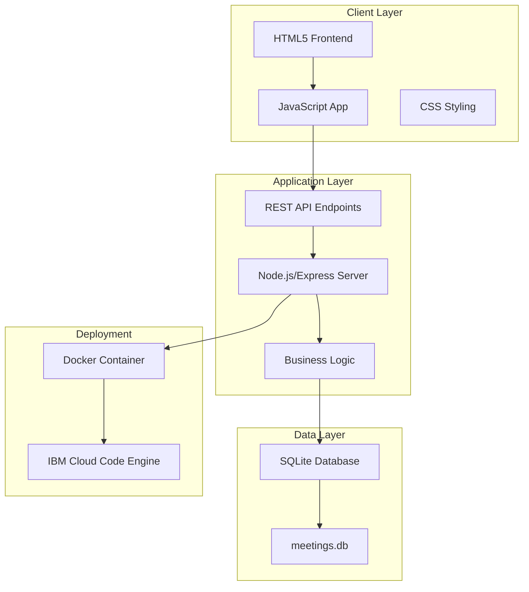

# Meeting & Travel Scheduling Application - Implementation Plan

## Project Overview
A containerized web application for a small team (3-5 users) to schedule meetings and share travel information. The solution uses a simple HTML5/JavaScript frontend with a Node.js backend and SQLite database, deployable to IBM Cloud Code Engine.

---

## Architecture Design



---

## Technology Stack

### Frontend
- HTML5 for structure
- Vanilla JavaScript (ES6+) for interactivity
- CSS3 for styling
- FullCalendar.js library for calendar view
- Fetch API for backend communication

### Backend
- Node.js (v18+)
- Express.js framework
- SQLite3 for database
- better-sqlite3 npm package for database operations
- CORS middleware for cross-origin requests

### DevOps
- Docker for containerization
- Docker Compose for local development
- IBM Cloud Code Engine for deployment
- IBM Cloud CLI for deployment automation

---

## Database Schema

### meetings table
```sql
CREATE TABLE meetings (
    id INTEGER PRIMARY KEY AUTOINCREMENT,
    title TEXT NOT NULL,
    description TEXT,
    start_datetime TEXT NOT NULL,
    end_datetime TEXT NOT NULL,
    location TEXT,
    attendees TEXT,
    customer TEXT,
    is_onsite INTEGER DEFAULT 0,
    country TEXT,
    created_at TEXT DEFAULT CURRENT_TIMESTAMP,
    updated_at TEXT DEFAULT CURRENT_TIMESTAMP
);
```

**Field Descriptions:**
- `customer`: Customer name or organization associated with the meeting
- `is_onsite`: Boolean field (0 = remote/virtual, 1 = on-site meeting)
- `country`: Optional country information for on-site meetings

---

## API Endpoints

### Meetings
- `GET /api/meetings` - List all meetings
- `GET /api/meetings/:id` - Get specific meeting
- `POST /api/meetings` - Create new meeting
- `PUT /api/meetings/:id` - Update meeting
- `DELETE /api/meetings/:id` - Delete meeting

### Health Check
- `GET /health` - Application health status

---

## Project Structure

```
meeting-app/
├── backend/
│   ├── src/
│   │   ├── server.js           # Express server setup
│   │   ├── database.js         # SQLite database initialization
│   │   ├── routes/
│   │   │   └── meetings.js     # Meeting routes
│   │   └── middleware/
│   │       └── errorHandler.js # Error handling
│   ├── package.json
│   └── Dockerfile
├── frontend/
│   ├── index.html              # Main application page
│   ├── css/
│   │   └── styles.css          # Application styles
│   ├── js/
│   │   ├── app.js              # Main application logic
│   │   ├── calendar.js         # Calendar functionality
│   │   └── meetings.js         # Meeting management
│   └── Dockerfile
├── docker-compose.yml          # Local development setup
├── .dockerignore
├── .gitignore
├── README.md                   # Setup and usage documentation
└── ibm-cloud/
    ├── backend-deployment.yaml # Code Engine config for backend
    └── deploy.sh               # Deployment script
```

---

## Key Features - Phase 1 (MVP)

### Meeting Management
- Create meetings with title, description, date/time, location, attendees, customer
- Mark meetings as on-site or remote/virtual
- Add optional country information for on-site meetings
- Edit existing meetings
- Delete meetings
- View all meetings in list format
- Filter meetings by customer

### Calendar View
- Monthly calendar display using FullCalendar.js
- Click on dates to create meetings
- Click on events to view/edit details
- Color-coded events by customer or meeting location type
- Visual indicators for international meetings

---

## Key Features - Phase 2 (Future Enhancements)

### Advanced Features
- Conflict detection for overlapping meetings
- Export to iCalendar format
- Search and filter functionality
- Week/day calendar views

### Collaboration
- Share meeting links
- Email notifications (using SendGrid or similar)
- Team member availability view

---

## Docker Configuration

### Backend Dockerfile
- Base image: `node:18-alpine`
- Expose port: 3000
- Volume mount for SQLite database persistence
- Health check endpoint

### Frontend Dockerfile
- Base image: `nginx:alpine`
- Serve static files
- Proxy API requests to backend
- Expose port: 80

### docker-compose.yml
- Backend service on port 3000
- Frontend service on port 8080
- Shared volume for database
- Network configuration for service communication

---

## IBM Cloud Code Engine Deployment

### Deployment Strategy
1. Build Docker images locally
2. Push images to IBM Cloud Container Registry
3. Create Code Engine application from container image
4. Configure environment variables
5. Set up persistent storage for SQLite database
6. Configure public endpoint

### Required IBM Cloud Resources
- Container Registry namespace
- Code Engine project
- Persistent volume claim for database
- Public endpoint configuration

### Environment Variables
- `PORT` - Application port (default: 3000)
- `DATABASE_PATH` - Path to SQLite database file
- `NODE_ENV` - Environment (production/development)
- `CORS_ORIGIN` - Allowed frontend origin

---

## Local Testing Workflow

### Initial Setup
```bash
docker-compose up --build
```

### Access Application
- Frontend: http://localhost:8080
- Backend API: http://localhost:3000
- Health check: http://localhost:3000/health

### Development Mode
- Use volume mounts for live code updates
- Database persists in `./data` directory
- View logs: `docker-compose logs -f`

### Testing Checklist
- Create a remote meeting
- Create an on-site meeting with country information
- View meetings in calendar
- Edit meeting details
- Toggle between on-site and remote
- Delete meeting
- Verify database persistence after restart

---

## Deployment Steps to IBM Cloud

### Prerequisites
- IBM Cloud account with Code Engine access
- IBM Cloud CLI installed
- Docker installed locally
- Container Registry namespace created

### Build and Push Images
```bash
# Login to IBM Cloud
ibmcloud login

# Build images
docker build -t meeting-app-backend ./backend
docker build -t meeting-app-frontend ./frontend

# Tag and push to registry
docker tag meeting-app-backend us.icr.io/namespace/meeting-app-backend:v1
docker push us.icr.io/namespace/meeting-app-backend:v1
```

### Deploy to Code Engine
```bash
# Create Code Engine project
ibmcloud ce project create --name meeting-app

# Deploy backend
ibmcloud ce application create \
  --name meeting-app-backend \
  --image us.icr.io/namespace/meeting-app-backend:v1 \
  --port 3000 \
  --min-scale 1 \
  --max-scale 2

# Deploy frontend
ibmcloud ce application create \
  --name meeting-app-frontend \
  --image us.icr.io/namespace/meeting-app-frontend:v1 \
  --port 80 \
  --env BACKEND_URL=<backend-url>
```

### Configure Persistent Storage
- Create persistent volume claim for SQLite database
- Mount volume to backend container at `/data`

---

## Security Considerations

### No Authentication (Current Scope)
- Shared access model for small team
- Application accessible to anyone with URL
- Suitable for internal team use only

### Future Security Enhancements
- Add basic authentication (username/password)
- Implement JWT tokens for API access
- Add HTTPS/TLS encryption
- Rate limiting on API endpoints

### Data Protection
- Regular database backups
- Input validation and sanitization
- SQL injection prevention (parameterized queries)
- XSS protection in frontend

---

## Documentation Requirements

### README.md should include
1. Project overview and features
2. Prerequisites and dependencies
3. Local development setup
4. Docker commands for building and running
5. API endpoint documentation
6. IBM Cloud deployment instructions
7. Troubleshooting guide
8. Future enhancement roadmap

---

## Success Criteria

The application will be considered complete when:
- ✅ Users can create, edit, and delete meetings
- ✅ Meetings can be marked as on-site or remote
- ✅ Country information can be added to on-site meetings
- ✅ Calendar view displays all meetings correctly with visual distinction
- ✅ Application runs in Docker containers locally
- ✅ Application successfully deploys to IBM Cloud Code Engine
- ✅ Data persists across container restarts
- ✅ All API endpoints function correctly
- ✅ Documentation is complete and accurate

---

## Estimated Timeline

- **Architecture & Setup:** 1-2 hours
- **Backend Development:** 3-4 hours
- **Frontend Development:** 4-5 hours
- **Docker Configuration:** 1-2 hours
- **Local Testing:** 1-2 hours
- **IBM Cloud Deployment:** 2-3 hours
- **Documentation:** 1-2 hours

**Total Estimated Time:** 13-20 hours

---

## Implementation Todo List

1. Design application architecture and technology stack ✅
2. Create project structure and Docker configuration
3. Implement backend API with Node.js/Express and SQLite
4. Build HTML5/JavaScript frontend with calendar view
5. Implement meeting CRUD operations with on-site/country fields
6. Create Docker containerization setup
8. Test application locally with Docker
9. Prepare IBM Cloud Code Engine deployment configuration
10. Deploy to IBM Cloud Code Engine
11. Document setup and usage instructions

---

## Notes

- Small team (3-5 users)
- No authentication required (shared access)
- SQLite database for simplicity
- Meetings include on-site flag and optional country field
- No separate travel_info table needed
- User is familiar with IBM Cloud Code Engine